# Eclipse

For setup/quick-start instructions, see ["Getting Started with Eclipse"](getting-started.md#getting-started-with-eclipse) first.  This section offers detailed usage info focusing on the typical development cycle.

## Running Eclipse

Eclipse _must_ be launched with the **Eclipse MaximSDK** shortcut. The shortcut points to the `Tools/Eclipse/cdt/eclipse(.bat/.sh)` file, which configures Eclipse's system environment for use with the MSDK toolchain.

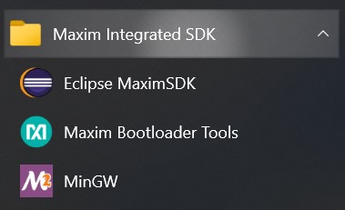

When Eclipse is launched, it will prompt for a **_workspace_** location. This is a local folder that Eclipse will copy its projects into.

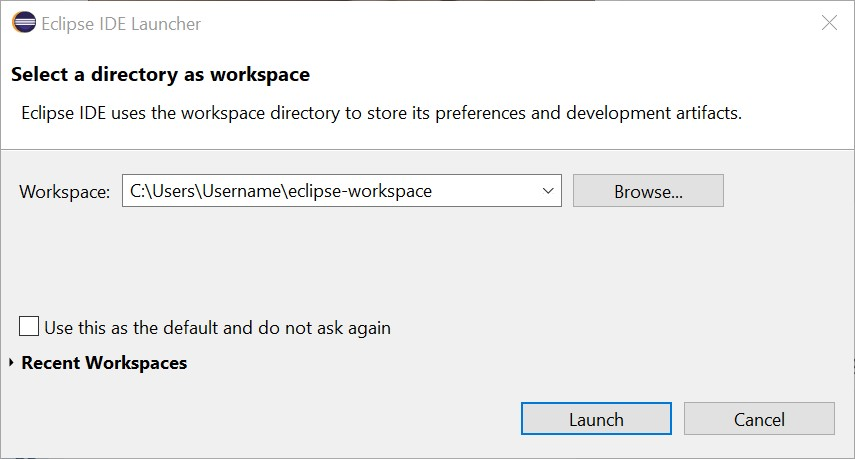

## Creating a New Project

1. [Launch](#running-eclipse) Eclipse.

2. Ensure that the Eclipse is set to the **C/C++ perspective** in the top right corner. Otherwise, the new project wizard will not show up.

3. Navigate to **File -> New -> Maxim Microcontrollers**.

    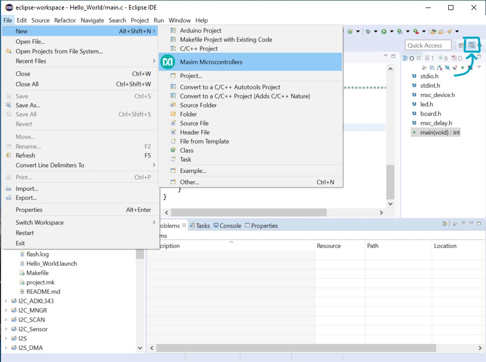

4. Enter the project name and hit **Next**.

    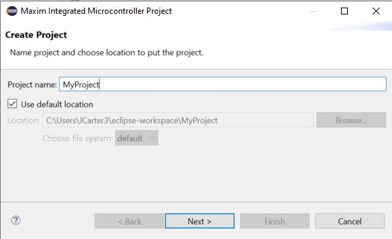

5. Follow the new project wizard.

    - Chip type selects the _Target Microcontroller_
    - Board type selects the [_Board Support Package (BSP)_](board-support-pkgs.md)
    - Example type selects the example project to be copied as the template for the new project.
    - Adapter type selects the debug adapter to use.

    

6. Select **Finish** to create the new project.

## Importing Examples

1. [Launch](#running-eclipse) Eclipse.

2. Use **File -> Import** to open the import wizard.

3. Select **General -> Existing Projects into Workspace** and hit **Next**.

    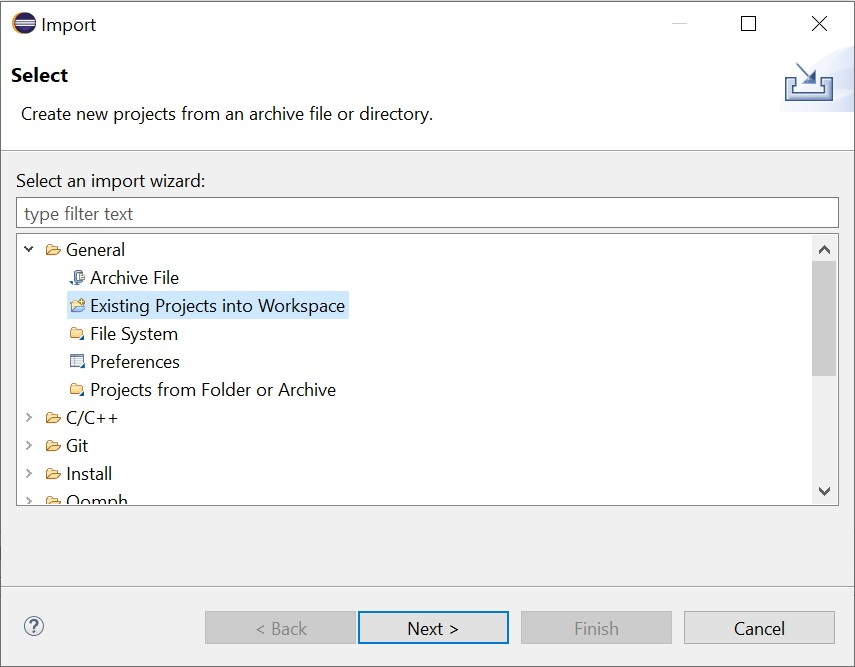

4. **Browse** to the [`Examples`](https://github.com/analogdevicesinc/msdk/tree/main/Examples) folder in the MSDK installation for your target microcontroller and select the example projects to import into the workspace.

    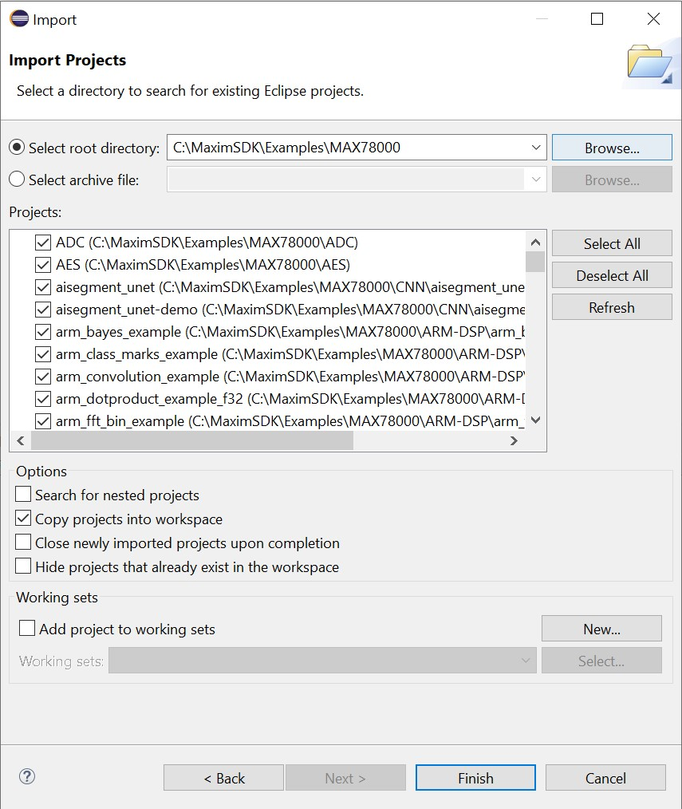

5. Ensure that **Copy projects into workspace** is selected. This will copy the projects out of the MSDK and leave the originals unmodified.

6. Select **Finish** to import the project(s).

7. The projects should now show up in the Project Explorer.

    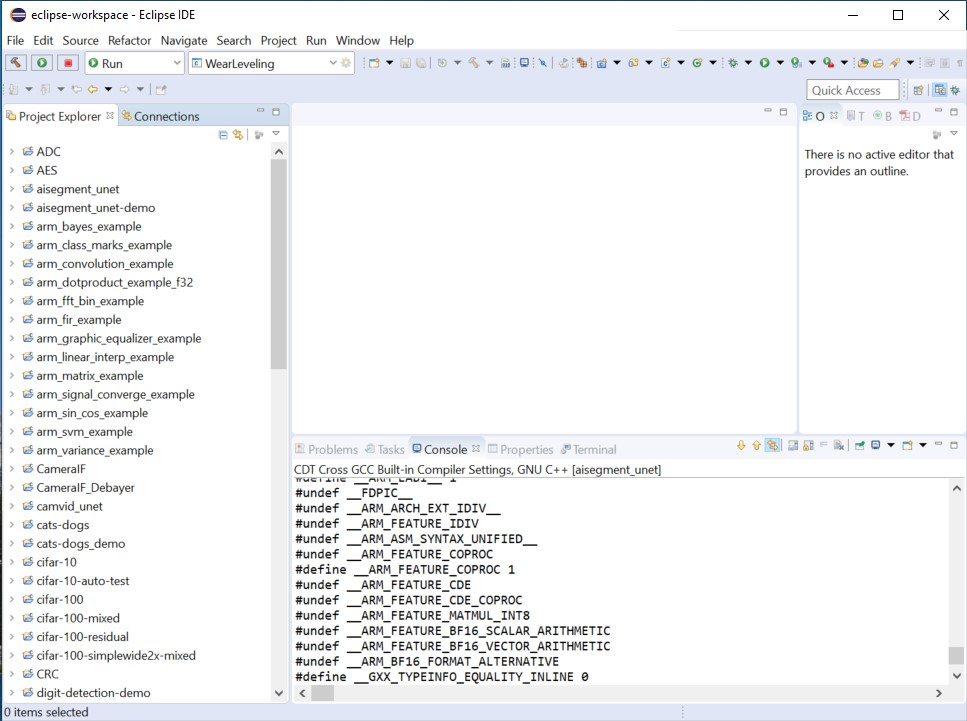

## How to Set the BSP (Eclipse)

[Imported](#importing-examples) Eclipse projects files are configured for the **EVKIT**-type _BSP_ by default. To set the BSP:

1. Right click the project name and select _Properties_.  Navigate to **C/C++ Build -> Environment**.
2. Set the **`BOARD`** _[Build Configuration Variable](build-system.md#build-tables)_ to match the target evaluation platform.

    See [Board Support Packages](board-support-pkgs.md) for a table of possible values.

    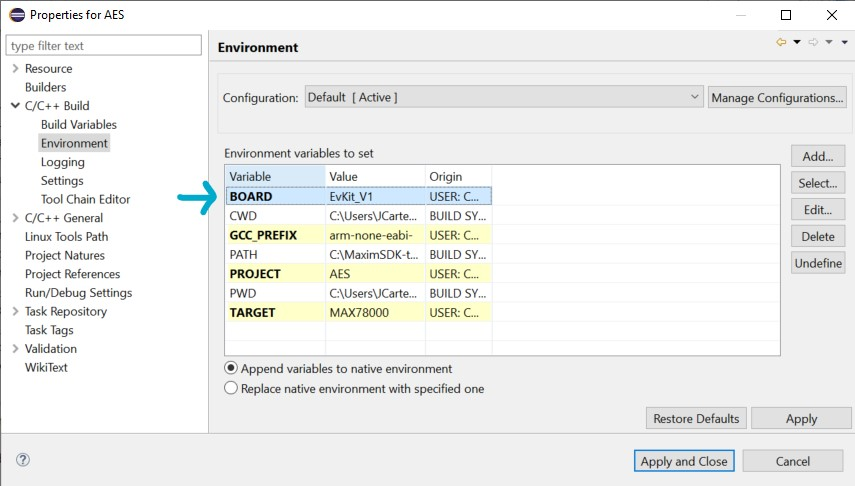

3. **clean** and rebuild the project.

## Building a Project

1. Ensure that the Eclipse is set to the **C/C++ perspective** (top right).

2. Select the correct project in the **Launch Configuration** dropdown.

3. Use the **Build** hammer button (top left) to build the project.

    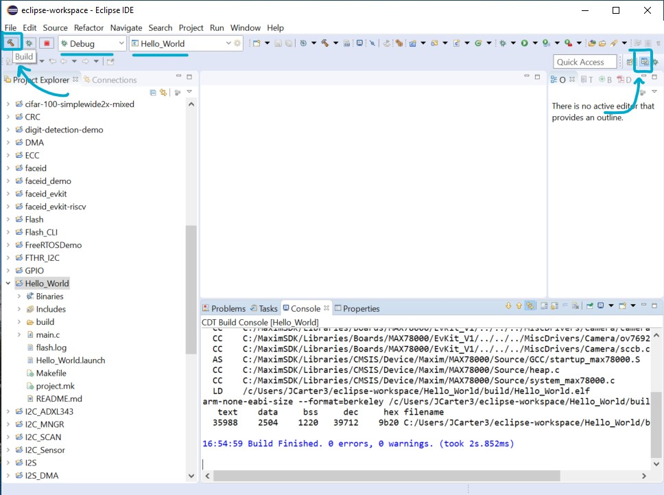

## Flashing and Debugging

1. Connect a debug adapter between the host PC and the evaluation platform. For more detailed instructions on this hardware setup, refer to the evaluation platform's Datasheet and Quick-Start Guide, which are available on its [analog.com](https://analog.com) product page.

2. Ensure the correct project in the **Launch Configuration** dropdown is selected in **Debug** mode.

3. Use the **Debug** button (top left) to flash the program binary and connect the debugger.

    

4. The Eclipse view will switch to debug mode, and the debugger will break on entry into the main.

    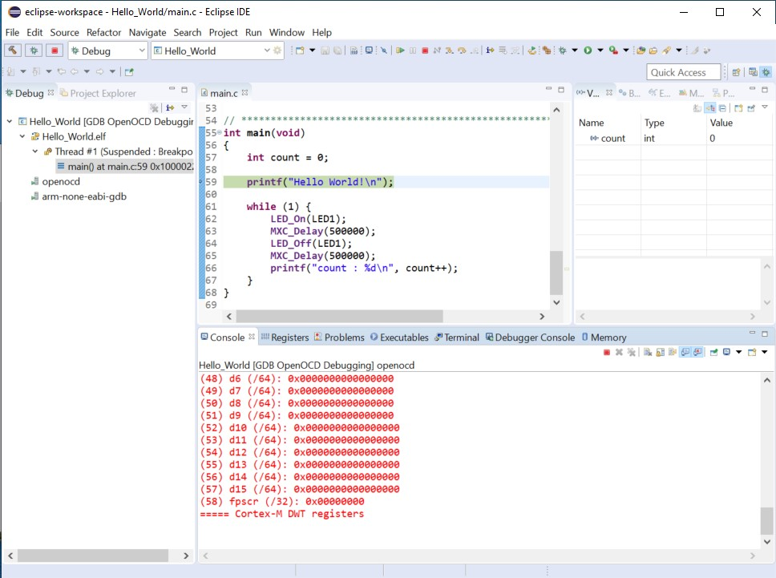

5. **Resume** the program (**`F8`**) using the top control bar and exercise the debugger.

    

6. **Terminate** the debugger (**`CTRL+F2`**) when finished.

### Segger J-Link Setup Guide (Eclipse)

Eclipse offers built-in support for Segger J-Link debuggers.  J-Link debugging can be enabled following the steps below:

1. Download and install the latest Segger J-Link Software and Documentation from [**here**](https://www.segger.com/downloads/jlink/)

2. Follow the instructions from the Segger J-Link Eclipse plugin [**here**](https://eclipse-embed-cdt.github.io/debug/jlink/) with the following modifications specific to the MSDK.  Other options an be left at their defaults.

    1. Modify the Executable name under "GDB Client Setup" to `arm-none-eabi-gdb${cross_suffix}`

        

    2. Modify the "Startup" options to issue a `monitor reset halt` under initialization commands and _uncheck_ `Pre-run/Restart reset`

        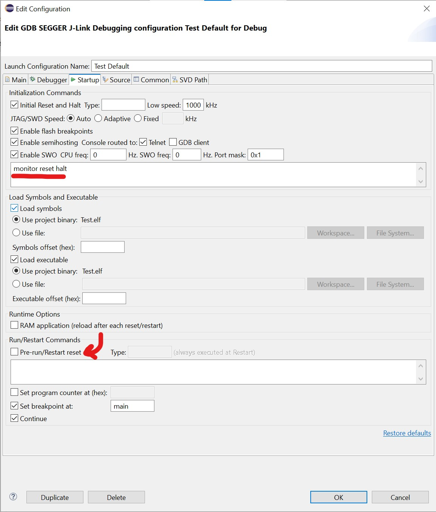
